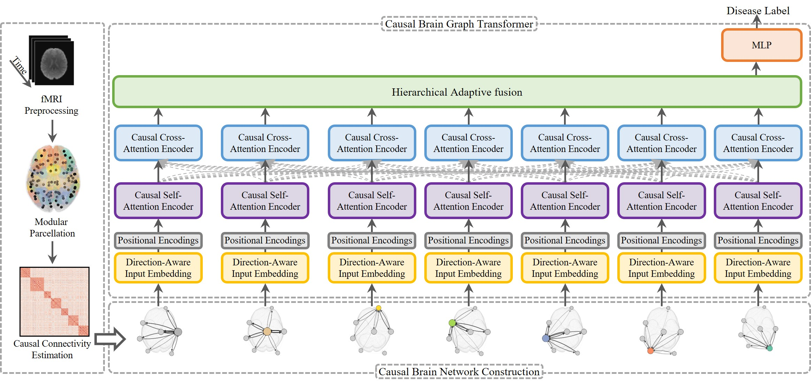

# BrainCGT: A Causal Brain Graph Transformer for Inferring Information Flow in Neurological Disorder Diagnosis

## Abstract

Brain connectivity analysis is vital for discovering biomarkers and understanding neurological disorders. Most existing graph-transformer approaches operate on undirected functional connectivity (FC) derived from symmetric correlation measures, which ignores directed causal information flow (effective connectivity) between brain regions. This can obscure direction-specific biomarkers and limits mechanistic interpretability. BrainCGT addresses this gap by constructing subject-specific directed causal graphs from resting-state fMRI using modular parcellation and multivariate Granger causality. The model uses direction-aware node embeddings and direction-biased intra-module self-attention plus inter-module cross-attention, followed by hierarchical adaptive fusion for graph-level diagnosis. Experiments on ADNI, PPMI, and ABIDE demonstrate consistent gains over strong functional-connectivity and causal-connectivity baselines, and a directed explainer produces edge/node/module attribution maps for post-hoc analysis.




## Datasets (access / download)

BrainCGT is evaluated on the following cohorts:

- **ADNI (Alzheimer’s Disease Neuroimaging Initiative)** — controlled access via LONI/IDA  
  Access: https://adni.loni.usc.edu/data-samples/adni-data/

- **PPMI (Parkinson’s Progression Markers Initiative)** — data access application required  
  Access: https://www.ppmi-info.org/access-data-specimens/download-data

- **ABIDE (Autism Brain Imaging Data Exchange)** — open sharing via INDI/NITRC  
  Project page: https://fcon_1000.projects.nitrc.org/indi/abide/  
  Database access notes: https://fcon_1000.projects.nitrc.org/indi/abide/databases.html

> You are responsible for complying with each dataset’s Data Use Agreement (DUA) and ethics/IRB requirements where applicable.


## How to run

### 1) Install

```bash
python -m venv .venv
source .venv/bin/activate

pip install -r requirements.txt
pip install -e .
```

### 2) Install neuroimaging tools

The preprocessing workflow uses **FSL** via Nipype. Install FSL and ensure the following commands are available on your `PATH`:

- `mcflirt`, `flirt`, `fnirt`

Set `FSLDIR` appropriately.

### 3) Prepare atlas resources

Place atlas files under `data/atlases/` and set paths in `configs/default.yaml`:

- Brainnetome labels NIfTI: `brainnetome_246_labels.nii.gz`
- ROI→module mapping CSV: `brainnetome_246_to_yeo7.csv` with columns `roi_id,module_id`
- ROI centroids CSV (MNI): `brainnetome_246_centroids_mni.csv` with columns `roi_id,x,y,z`

### 4) Create subject index

Create `data/subjects.csv` with columns:
`subject_id,fmri_path,confounds_path,site_id,label`

Example:

```csv
subject_id,fmri_path,confounds_path,site_id,label
sub-0001,/path/to/sub-0001_bold.nii.gz,/path/to/sub-0001_confounds.tsv,siteA,0
sub-0002,/path/to/sub-0002_bold.nii.gz,/path/to/sub-0002_confounds.tsv,siteB,1
```

### 5) Run the pipeline

```bash
# (a) fMRI preprocessing
python scripts/preprocess.py  --config configs/default.yaml --subjects_csv data/subjects.csv

# (b) parcellation + Granger causality → directed graphs
python scripts/build_graphs.py --config configs/default.yaml --subjects_csv data/subjects.csv

# (c) k-fold training
python scripts/train.py --config configs/default.yaml --graphs_dir data/derivatives/graphs

# (d) inference
python scripts/infer.py --config configs/default.yaml --checkpoint <path/to/best_ckpt.pt> --graphs_dir data/derivatives/graphs

# (e) explainability (directed edge/node/module attributions)
python scripts/explain.py --config configs/default.yaml --checkpoint <path/to/best_ckpt.pt> --graph_pt data/derivatives/graphs/<subject_id>.pt
```

Outputs (checkpoints, metrics, predictions, explanations) are written under the results directory configured in `configs/default.yaml`.


## Requirements (libraries and tools)

### Tools

- Python 3.10+
- FSL (called through Nipype)
- CUDA-capable GPU (recommended, optional)

### Key Python libraries

- `torch`
- `torch-geometric`
- `numpy`, `scipy`, `pandas`
- `scikit-learn`
- `statsmodels` (VAR / Granger causality)
- `nibabel`, `nilearn`, `nipype` (neuroimaging IO + workflows)
- `neuroHarmonize` (ComBat harmonization; applied fold-safely)
- `pydantic`, `PyYAML` (configuration)
- `loguru`, `tqdm`


## Citation

If you use this repository in academic work, please cite the BrainCGT paper:

```bibtex
@article{BrainCGT2026,
  title   = {BrainCGT: A Causal Brain Graph Transformer for Inferring Information Flow in Neurological Disorder Diagnosis},
  author  = {[ADD AUTHORS]},
  journal = {[ADD VENUE]},
  year    = {2026}
}
```
